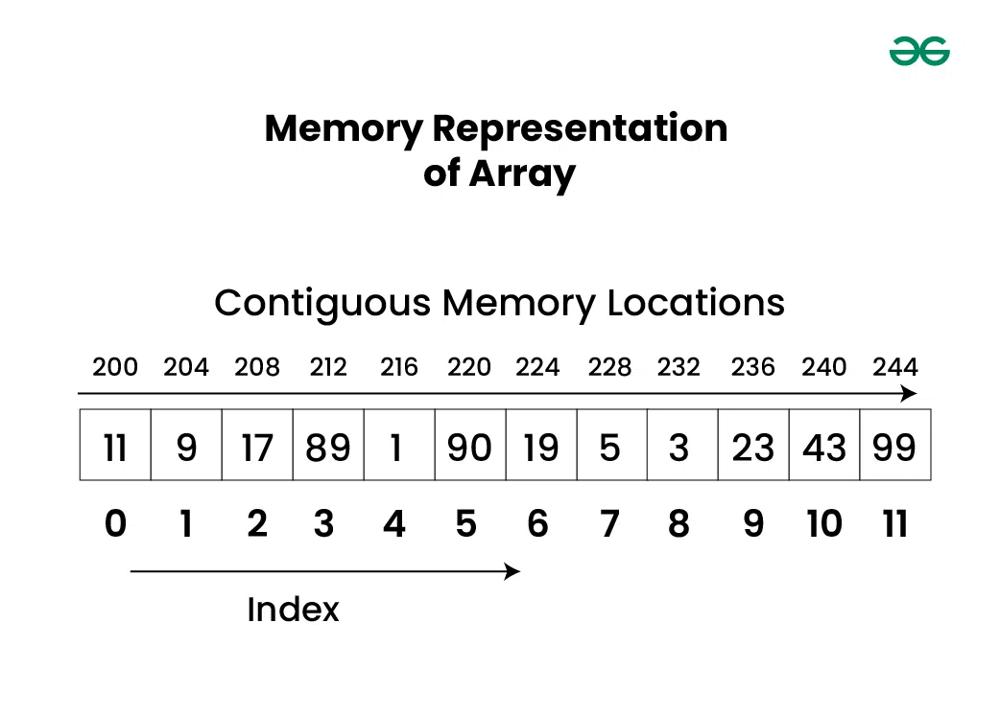
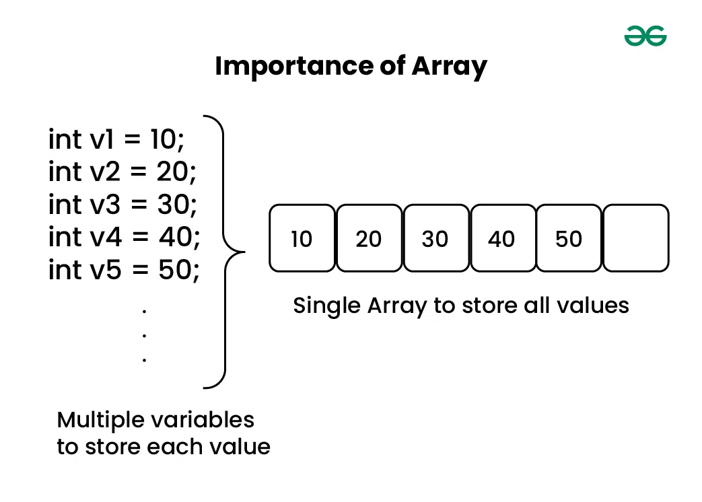
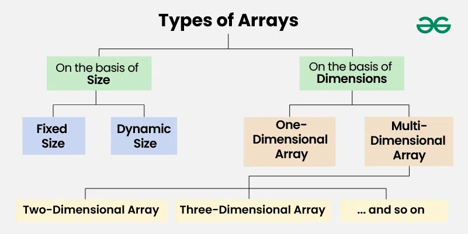
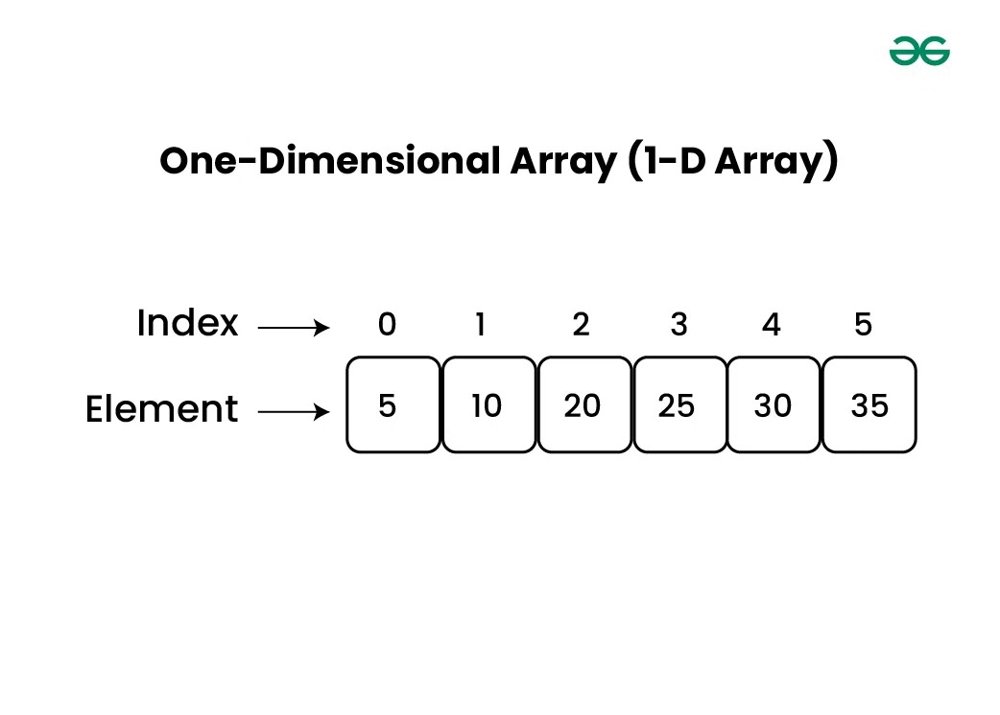
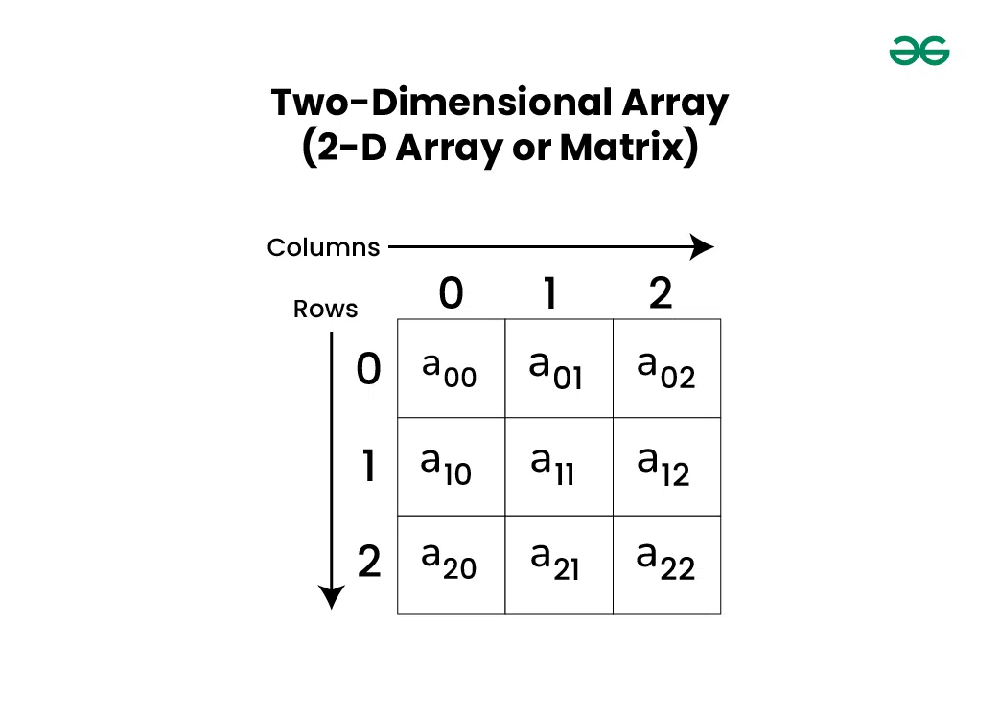
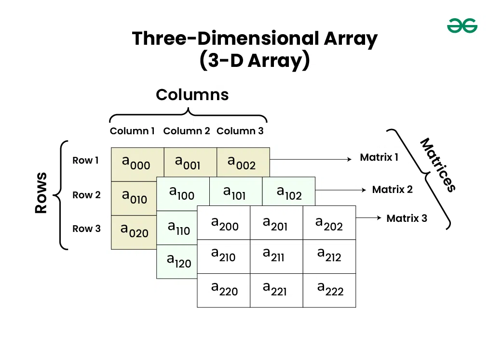

### Array

Array is a linear data structure that stores a collection of elements of the same data type. Elements are allocated contiguous memory, allowing for constant-time access. Each element has a unique index number.

### Declaration of Array

arr = []

### Initialization of Array

arr=[1,2,3,4,5,6]
arr=[a,b,c,d,e,f]
arr=[11.2,3.4,5.6]

### Why do we need Arrays?

### Types of Arrays basis on Size

 ### 1. Fixed Size Arrays

          arr=[0]*5
          print(arr)

### 2. Dynamic Size Arrays

       arr=[]

### Types of Arrays basis on Dimensions

### 1. 1-D

### 2. 2-D

### 3. 3-D

