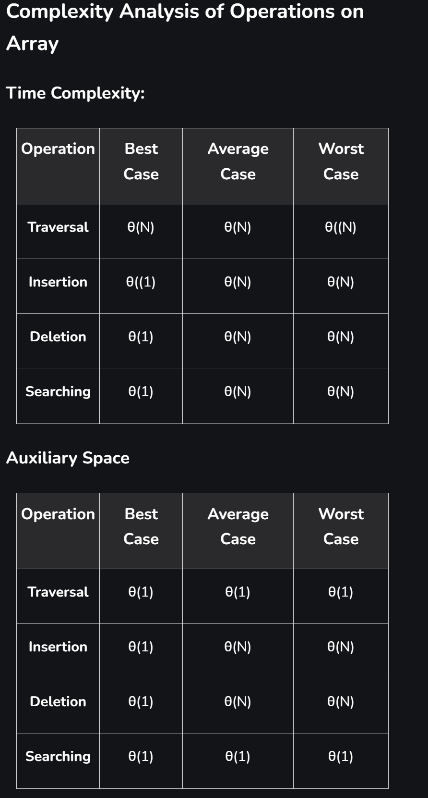
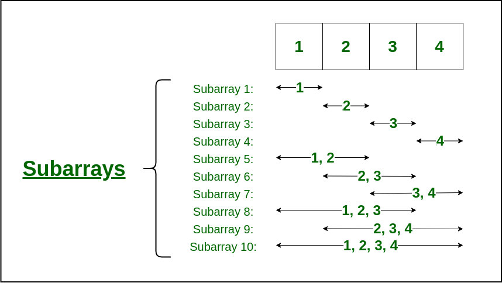
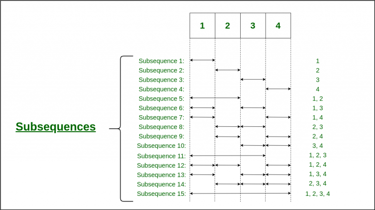
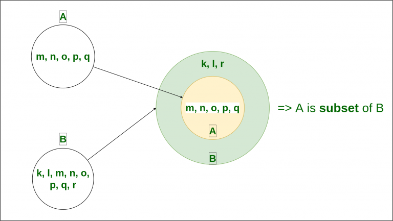

### [`refcode`](ops.py)
### Advantages of Array Data Structure:
Efficient and Fast Access: Arrays allow direct and efficient access to any element in the collection with constant access time, as the data is stored in contiguous memory locations.

### Memory Efficiency: 
Arrays store elements in contiguous memory, allowing efficient allocation in a single block and reducing memory fragmentation.

### Versatility: 
Arrays can be used to store a wide range of data types, including integers, floating-point numbers, characters, and even complex data structures such as objects and pointers.

### Compatibility with hardware: 
The array data structure is compatible with most hardware architectures, making it a versatile tool for programming in a wide range of environments.

### Disadvantages of Array Data Structure:
### Fixed Size: 
Arrays have a fixed size set at creation. Expanding an array requires creating a new one and copying elements, which is time-consuming and memory-intensive.

### Memory Allocation Issues: 
Allocating large arrays can cause memory exhaustion, leading to crashes, especially on systems with limited resources.

### Insertion and Deletion Challenges: 
Adding or removing elements requires shifting subsequent elements, making these operations inefficient.

### Limited Data Type Support: 
Arrays support only elements of the same type, limiting their use with complex data types.

### Lack of Flexibility:
Fixed size and limited type support make arrays less adaptable than structures like linked lists or trees.

### Array Traversal 
1. run loop from i=0 to n
2. print array inside loop

### Array Searching 
1. run loop from i=0 to n
2. check key with run time arr val
3. return i if found otherwise -1

### Array Insertion 
1. either use arr[pos]= key 
2. or user arr.insert(pos,key)
3. Its always update list , return None, so dont hold it in new variable

### Array Deletion 
1. Either use arr.remove(val)
2. or find pos, run loop from pos till n
3. and shift every item to left due to empty deleted position use arr[i] = arr[i+1]

### Time Complexity:

## Subarrays, Subsequences, and Subsets in Array

### Subarrays
A subarray is a contiguous part of array, i.e., Subarray is an array that is inside another array.

In general, for an array of size n, there are n*(n+1)/2 non-empty subarrays.

For example, Consider the array [1, 2, 3, 4], There are 10 non-empty sub-arrays. The subarrays are:

(1), (2), (3), (4), (1,2), (2,3), (3,4), (1,2,3), (2,3,4), and (1,2,3,4)

### Subsequence
A subsequence is a sequence that can be derived from another sequence by removing zero or more elements, without changing the order of the remaining elements.

More generally, we can say that for a sequence of size n, we can have (2n – 1) non-empty sub-sequences in total.
(1), (2), (3), (4), (1,2), (1,3),(1,4), (2,3), (2,4), (3,4), (1,2,3), (1,2,4), (1,3,4), (2,3,4), (1,2,3,4).

### Subset 
If a Set has all its elements belonging to other sets, this set will be known as a subset of the other set.

A Subset is denoted as “⊆“. If set A is a subset of set B, it is represented as A ⊆ B.

For example, Let Set_A = {m, n, o, p, q}, Set_ B = {k, l, m, n, o, p, q, r}

