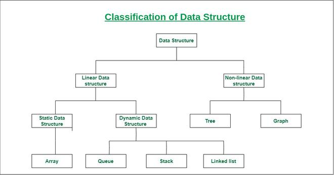

### What is data structure
A data structure is a storage that is used to store and organize data. It is a way of arranging data on a computer so that it can be accessed and updated efficiently.

A data structure is not only used for organizing the data. It is also used for processing, retrieving, and storing data.

### Classification of Data Structure

### Linear Data Structure: 
Data structure in which data elements are arranged sequentially or linearly, where each element is attached to its previous and next adjacent elements, is called a linear data structure. 
Example: Array, Stack, Queue, Linked List, etc.

### Static Data Structure: 
Static data structure has a fixed memory size. It is easier to access the elements in a static data structure. 
Example: array.

### Dynamic Data Structure:
In dynamic data structure, the size is not fixed. It can be randomly updated during the runtime which may be considered efficient concerning the memory (space) complexity of the code. 
Example: Queue, Stack, etc.

### Non-Linear Data Structure:
 Data structures where data elements are not placed sequentially or linearly are called non-linear data structures. In a non-linear data structure, we can’t traverse all the elements in a single run only. 
Examples: Trees and Graphs.