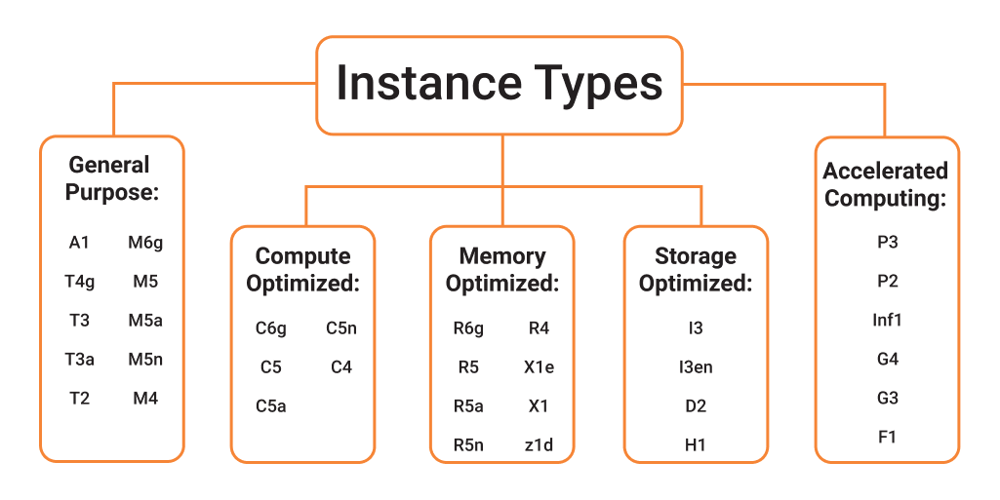
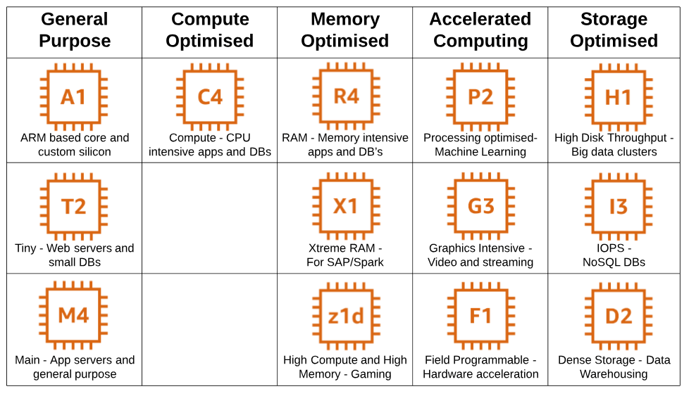
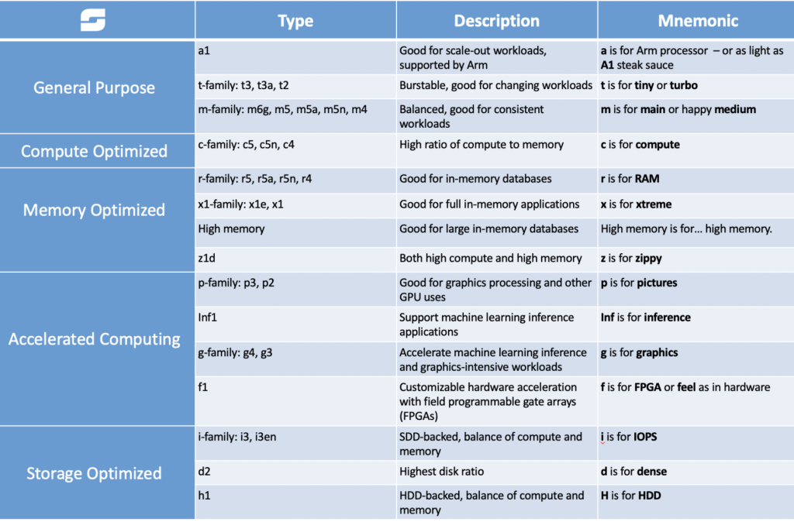

### EC2

### Elastic Compute Cloud

Main Capabilities
Renting virtual machines (EC2)
Storing data on virtual machine (EBS)
Distributing load across machine (ELB)
Scaling services using an auto scaling Group

### EC2 User Data
It is possible to bootstrap our instance using EC2 User Data Script
Bootstrapping means launching command when a machine starts
That script is only run once at the instance first start.
Installing updates / installing software / downloading common files from the internet are used to automate boot tasks.
EC2 user data script runs with the root user.

### EC2 Types

### 1. General Purpose
General purpose instances provide a balance of compute, memory and networking resources, and can be used for a variety of diverse workloads. These instances are ideal for applications that use these resources in equal proportions such as web servers and code repositories. 

#### Use cases

Applications built on open source software such as application servers, microservices, gaming servers, midsize data stores, and caching fleets.

### Compute Optimized

Compute Optimized instances are ideal for compute bound applications that benefit from high performance processors. Instances belonging to this category are well suited for batch processing workloads, media transcoding, high performance web servers, high performance computing (HPC), scientific modeling, dedicated gaming servers and ad server engines, machine learning inference and other compute intensive applications.

####  Use cases

Memory-intensive workloads such as open source databases, in-memory caches, and real-time big data analytics.

### Accelerated Computing

Accelerated computing instances use hardware accelerators, or co-processors, to perform functions, such as floating point number calculations, graphics processing, or data pattern matching, more efficiently than is possible in software running on CPUs.

#### Use Cases
Generative AI applications, including question answering, code generation, video and image generation, speech recognition, and more.
HPC applications at scale in pharmaceutical discovery, seismic analysis, weather forecasting, and financial modeling.

### Storage Optimized
Storage optimized instances are designed for workloads that require high, sequential read and write access to very large data sets on local storage. They are optimized to deliver tens of thousands of low-latency, random I/O operations per second (IOPS) to applications.

#### Use Cases
I/O intensive workloads that require real-time latency access to data such as relational databases (MySQL, PostgreSQL), real-time databases, NoSQL databases (Aerospike, Apache Druid, Clickhouse, MongoDB), and real- time analytics such as Apache Spark.

### HPC Optimized
High performance computing (HPC) instances are purpose built to offer the best price performance for running HPC workloads at scale on AWS. HPC instances are ideal for applications that benefit from high-performance processors such as large, complex simulations and deep learning workloads

### Instance Features
Amazon EC2 instances provide a number of additional features to help you deploy, manage, and scale your applications.
Burstable Performance Instances
Amazon EC2 allows you to choose between Fixed Performance instance families (e.g. M6, C6, and R6) and Burstable Performance Instance families (e.g. T3). Burstable Performance Instances provide a baseline level of CPU performance with the ability to burst above the baseline.  

T Unlimited instances can sustain high CPU performance for as long as a workload needs it. For most general-purpose workloads, T Unlimited instances will provide ample performance without any additional charges. The hourly T instance price automatically covers all interim spikes in usage when the average CPU utilization of a T instance is at or less than the baseline over a 24-hour window. If the instance needs to run at higher CPU utilization for a prolonged period, it can do so at a flat additional charge of 5 cents per vCPU-hour.  

T instances’ baseline performance and ability to burst are governed by CPU Credits. Each T instance receives CPU Credits continuously, the rate of which depends on the instance size. T instances accrue CPU Credits when they are idle, and use CPU credits when they are active. A CPU Credit provides the performance of a full CPU core for one minute.  

For example, a t2.small instance receives credits continuously at a rate of 12 CPU Credits per hour. This capability provides baseline performance equivalent to 20% of a CPU core (20% x 60 mins = 12 mins). If the instance does not use the credits it receives, they are stored in its CPU Credit balance up to a maximum of 288 CPU Credits. When the t2.small instance needs to burst to more than 20% of a core, it draws from its CPU Credit balance to handle this surge automatically.  

With T2 Unlimited enabled, the t2.small instance can burst above the baseline even after its CPU Credit balance is drawn down to zero. For a vast majority of general purpose workloads where the average CPU utilization is at or below the baseline performance, the basic hourly price for t2.small covers all CPU bursts. If the instance happens to run at an average 25% CPU utilization (5% above baseline) over a period of 24 hours after its CPU Credit balance is drawn to zero, it will be charged an additional 6 cents (5 cents/vCPU-hour x 1 vCPU x 5% x 24 hours).  

Many applications such as web servers, developer environments and small databases don’t need consistently high levels of CPU, but benefit significantly from having full access to very fast CPUs when they need them. T instances are engineered specifically for these use cases. If you need consistently high CPU performance for applications such as video encoding, high volume websites or HPC applications, we recommend you use Fixed Performance Instances. T instances are designed to perform as if they have dedicated high speed processor cores available when your application really needs CPU performance, while protecting you from the variable performance or other common side-effects you might typically see from over-subscription in other environments.  

### Multiple Storage Options
Amazon EC2 allows you to choose between multiple storage options based on your requirements. Amazon EBS is a durable, block-level storage volume that you can attach to a single, running Amazon EC2 instance. You can use Amazon EBS as a primary storage device for data that requires frequent and granular updates. For example, Amazon EBS is the recommended storage option when you run a database on Amazon EC2. Amazon EBS volumes persist independently from the running life of an Amazon EC2 instance. Once a volume is attached to an instance you can use it like any other physical hard drive. Amazon EBS provides three volume types to best meet the needs of your workloads: General Purpose (SSD), Provisioned IOPS (SSD), and Magnetic. General Purpose (SSD) is the new, SSD-backed, general purpose EBS volume type that we recommend as the default choice for customers. General Purpose (SSD) volumes are suitable for a broad range of workloads, including small to medium sized databases, development and test environments, and boot volumes. Provisioned IOPS (SSD) volumes offer storage with consistent and low-latency performance, and are designed for I/O intensive applications such as large relational or NoSQL databases. Magnetic volumes provide the lowest cost per gigabyte of all EBS volume types. Magnetic volumes are ideal for workloads where data is accessed infrequently, and applications where the lowest storage cost is important.  

Many Amazon EC2 instances can also include storage from devices that are located inside the host computer, referred to as instance storage. Instance storage provides temporary block-level storage for Amazon EC2 instances. The data on instance storage persists only during the life of the associated Amazon EC2 instance.  

In addition to block level storage via Amazon EBS or instance storage, you can also use Amazon S3 for highly durable, highly available object storage. Learn more about Amazon EC2 storage options from the Amazon EC2 documentation.  

### EBS-optimized Instances

For an additional, low, hourly fee, customers can launch selected Amazon EC2 instances types as EBS-optimized instances. EBS-optimized instances enable EC2 instances to fully use the IOPS provisioned on an EBS volume. EBS-optimized instances deliver dedicated throughput between Amazon EC2 and Amazon EBS, with options between 500 Megabits per second (Mbps) and 80 Gigabits per second (Gbps), depending on the instance type used. The dedicated throughput minimizes contention between Amazon EBS I/O and other traffic from your EC2 instance, providing the best performance for your EBS volumes. EBS-optimized instances are designed for use with all EBS volumes. When attached to EBS-optimized instances, Provisioned IOPS volumes can achieve single digit millisecond latencies and are designed to deliver within 10% of the provisioned IOPS performance 99.9% of the time. We recommend using Provisioned IOPS volumes with EBS-optimized instances or instances that support cluster networking for applications with high storage I/O requirements.  

### Cluster Networking
Select EC2 instances support cluster networking when launched into a common cluster placement group. A cluster placement group provides low-latency networking between all instances in the cluster. The bandwidth an EC2 instance can utilize depends on the instance type and its networking performance specification. Inter instance traffic within the same region can utilize up to 5 Gbps for single-flow and up to 100 Gbps for multi-flow traffic in each direction (full duplex). Traffic to and from S3 buckets in the same region can also utilize all available instance aggregate bandwidth. When launched in a placement group, instances can utilize up to 10 Gbps for single-flow traffic and up to 100 Gbps for multi-flow traffic. Network traffic to the Internet is limited to 5 Gbps (full duplex). Cluster networking is ideal for high performance analytics systems and many science and engineering applications, especially those using the MPI library standard for parallel programming.

PORTS

22 SSh  
21 FTP  
22 SFTP  
80 HTTP  
443 HTTPS  
3389 Remote Desktop protocol  

