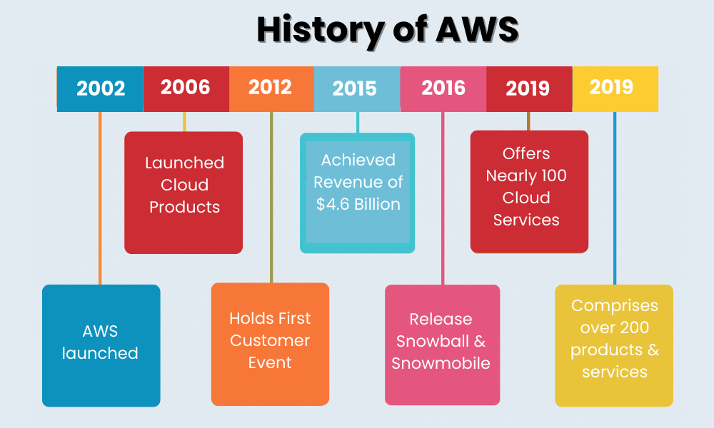
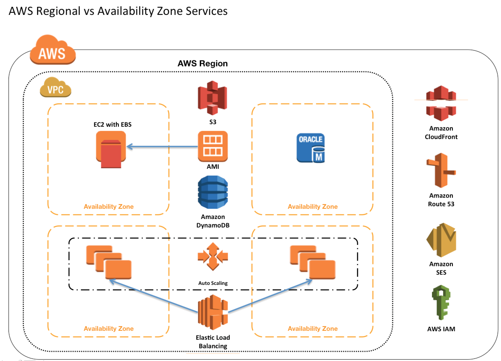

### Fundamentals

### AWS Region
1. AWS has regions all around the world
2. Names can be like us-east-1, eu-west-3 … etc.
3. A region is a cluster of data center
4. Mostly AWS services are region scoped

### History

### Availability Zones

Every region has many availability zones. Min- 3 , Max- 6

