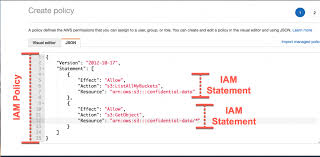

### IAM
### IAM Role: 
1. some AWS services need to perform actions on your behalf. To do so, we assign permissions to AWS services with IAM Roles
2. IAM security tool: IAM credentials report for all IAM users and the status of their various credentials
3. IAM Policies are JSON documents that define a set of permissions for making requests to AWS services. And can be used by IAM users, user groups, and IAM roles.
4. IAM User Groups can not be part of other User Groups
5. A statement in an IAM policy consists of Sid, Effect, Principle, Action,Resource and Conditions. Version is Part of the IAM policy itself, not statement.
6. IAM credentials report list of all your AWS account’s IAM users and the status of their various credentials.
7. User can be created in Group, Group only contain users not other Group
8. Users and Groups can be assigned JSON documents called Policies.
9. These Policies define the permission of the users.
10. Inline policies are those directly attached to the user.

### IAM Policies

### IAM Policies JSON structure

